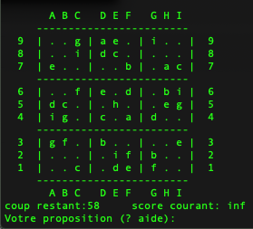

# sudoku
Jeu sudoku en C (2016)

## I)	Introduction

Ce programme permet à joueur de remplir une grille de sudoku de format 4x4,6x6,8x8,9x9. Il est écrit en language C et tourne sur toute machine Unix après génération. Ce sudoku represente la version 2 (version amélioré du projet 1).

## II) Prérequis système

Le programme fonctionne sur Unix/mac/windows mais pour cela il y’a des prérequis :
Le programme étant écrit en C :

- S’assurer que le package contenant les bibliothèques, qui permettent au processeur de votre machine de lire et compiler le programme, sont déjà téléchargés. 

Pour transformer le code source de notre programme en language de programmation, il faut un compilateur : sous unix compiler le programme grace à la commande MAKE (s'assurer que tous les fichiers du prgrammes sont dans le meme repertoire)

## III) installation et Utilisation
Le programme est composé de plusieurs fichiers "sudoku.c","pile.c", "pile.h","makefile"d’un fichier "sudoku-db.txt" ...
Ouvrir le terminal puis se placer sous le repertoire ou se trouve le programme
Compiler écrivant en ligne de commande : make (qui doit detecter le makefile)

## IV.1) Options

-h affiche sur le flux standard de sortie une aide et s’arrête
-g Ecrit sur le flux standard de sortie les grilles disponibles et se termine
-s Ecrit sur le flux standard de sortie les grilles remplies disponibles et se termine
-t # choisir une grille # : les valeurs de # étant 4x4, 6x6, 8x8, 9x9, rand. La valeur de rand signifie de choisir une taille de grille au hasard. Si cet argument est omis le défaut est 9*9 
-d # lire la datta base de sudoku dans le fichier #.

Comment utiliser le programme.
Le programme fonctionne avec un interface utilisateur (homme/machine)
- L’utilisateur peut voir l’aide pour connaitre les options
Sur le terminal : ./a.out -h 
- L’utilisateur choisit un format de grille qu’il veut jouer
exemple: ./a.out -t 4x4
Ainsi la grille initiale non encore remplie s’affiche
- Si l’utilisateur ne choisit pas de grille, la grille 9x9 est choisie par défaut
- Le joueur choisie une grille et entre la valeur la lettre qu’il veut jouer
Ex : A 1 R
A est l’abscisse de la case
1 est l’ordonnée de la case 
V est la lettre qu’on veut jouer
Pour la grille 4X4 on a 13 chances
Pour la grille 6x6 on a 29 chances
Pour la grille 8x8 on a 52 chances
Pour la grille 9x9 on a 58 chances

-Si la case est déjà remplie (case initiale) il faut recommencer la saisie sur une case vide. La lettre entrée doit être unique dans une colonne, dans une ligne et une région de la grille.
-On peut toujours revenir en arrière pour modifier le coup joué en entrant le caractère « < » sur la console (c’est l’historique). 
-Lorsque le jeu n’est pas résolu jusqu’à l’épuisement du nombre de chances de jouer, le jeu est terminé et le programme affiche la solution
 Si la grille est résolu, vous avez gagné : le jeu est terminé.

